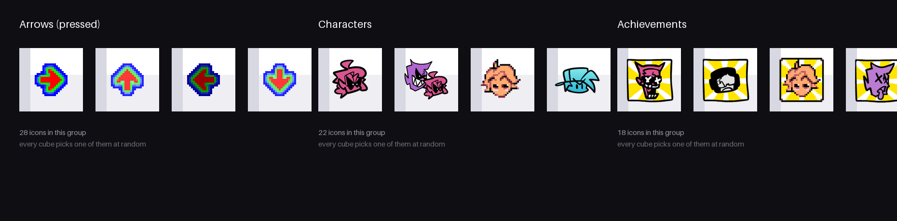

# Cubes Live Wallpaper
Cubes Live Wallpaper is live wallpaper application for Android 2.3.3 using the OpenGL ES 2.0, gravity, acceleration sensors and real time physics.

Application is available on the Google Play Market <https://play.google.com/store/apps/details?id=mobile.wallpaper.cubeslivewallpaper&hl=en>.


## Compilation
Android SDK, Eclipse, Eclipse Android plugin is required. Please follow the official tutorial how to setup the environment.
Than import the project into Eclipse.

## Cube textures (icon groups)

The cubes are not textured with the Android robot any more, they wear icons of
the [Friday Night Funkin' Phoenix Engine](https://github.com/havaianasdestruido/FNF-Phoenix-Engine).

The icons are organized in *groups* (one icon mode per group):

| Group | Icons | Source |
| --- | --- | --- |
| Arrows | 28 | the pressed note arrows, cut out of the noteskin sprite sheets (vanilla default/classic/future and the pixel skin) |
| Characters | 22 | the health icons, `assets/preload/images/icons` (the *normal* frame only) |
| Achievements | 18 | the achievement icons, `assets/preload/images/achievements` |



Most of the health icons are not single pictures but a horizontal strip of
150x150 frames: frame 0 is the normal icon, the frames after it are the losing
and the winning one (the engine reads them with `iSize = round(width / height)`,
see `changeIcon()` in `source/objects/HealthIcon.hx` of the Phoenix Engine).
Only the normal frame is used, the losing/winning frames are cropped away by
`tools/fetch_icons.py`. The achievement icons are single pictures.

A wallpaper always wears icons of a single group: when the group changes, every
cube picks a new random icon of the new group, so the cubes of one wall never
show a mixture of two groups. How often that happens is controlled by two
constants in `GLES20Renderer`:

```java
ICON_GROUP_SWITCH_MS = 25000; // how long a wall wears one group
ICON_SHUFFLE_MS      = 8000;  // how long the cubes keep their icons inside a group
```

Only the textures of the active group are kept in the graphic card memory, the
textures of the previous group are deleted when the wall switches
(`IconLibrary`).

The textures are downloaded into `res/drawable-nodpi` (so Android does not scale
them for the screen density) and are listed in `IconGroups.java`:

```
python3 tools/fetch_icons.py            # download/refresh the icons
python3 tools/fetch_icons.py --clean    # ... and drop the old ones first
```

The script needs [Pillow](https://python-pillow.org/) (`pip install pillow`) and
fetches the files through the GitHub API, so `GITHUB_TOKEN` is only needed to
raise the anonymous rate limit. To add an icon, drop the file into
`res/drawable-nodpi` and add it to the matching group in `IconGroups.java`.

## Known limitations
Cubes are actually spheres. The source include balls elastic collision
Only last rotation apply to objects. The rotation matrix are not yet multiplied
The energy of objects is not shared between rotation and translation movement. Rotation can't cause movement after impact.

Android texture: Portion of this application (Android texture) is reproduced from work created and shared by Google and used according to terms described in the Creative Commons 3.0 Attribution License.

Cube icons: The icons used as cube textures come from the Friday Night Funkin' Phoenix Engine (https://github.com/havaianasdestruido/FNF-Phoenix-Engine), which is licensed under the Apache License 2.0. They are downloaded by tools/fetch_icons.py.
GLWallpaperService: Livewallpaper supports OpenGL ES 2.0 thanks to Robert Green's GLWallpaperService.

## Attribution
Copyright 2011, 2012 Martin Kacer

All the content and resources have been provided in the hope that it will be useful. 
Author do not take responsibility for any misapplication of it. The software is distributed
in the hope that will be useful, but WITHOUT ANY WARRANTY.

## License
This program is free software: you can redistribute it and/or modify
it under the terms of the GNU General Public License as published by
the Free Software Foundation, either version 3 of the License, or
(at your option) any later version.

This program is distributed in the hope that it will be useful,
but WITHOUT ANY WARRANTY; without even the implied warranty of
MERCHANTABILITY or FITNESS FOR A PARTICULAR PURPOSE.  See the
GNU General Public License for more details.

You should have received a copy of the GNU General Public License
along with this program.  If not, see <http://www.gnu.org/licenses/>.
